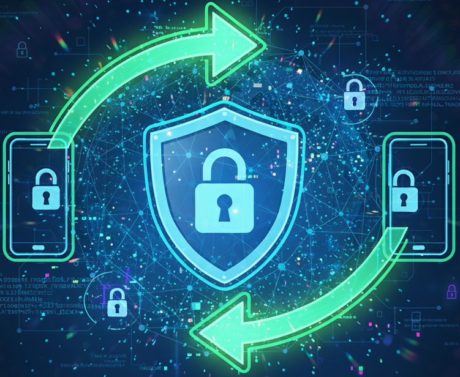

## TL;DR
End-to-end encryption isn't just about keeping secrets from a hacker / eavesdroper —
it's about building systems where users don't have to trust anyone but themselves.
In this series, we'll build a simple post-quantum secure E2E encrypted communication system.

By the end of this 3-part series, you'll have implemented:
- ✅ Post-quantum secure key exchange (PQXDH)
- ✅ End-to-end encrypted file sharing
- ✅ A working demo that encrypts and decrypts images

Code coming in parts 2 and 3!

---

## The Problem: Learning E2E Encryption is Hard

I've been trying to build an end-to-end encrypted communication system for <a href="https://www.syftbox.net/" target="_blank" rel="noopener noreferrer">SyftBox</a> —
an open-source network for privacy-first, offline-capable AI.
However, when I started researching how to implement proper E2E encryption, I hit a wall.

The <a href="https://signal.org/docs/specifications/pqxdh/" target="_blank" rel="noopener noreferrer">Signal Protocol</a> is the gold standard for
implementing E2E encryption systems—it's what powers Signal, WhatsApp, and many other secure messaging apps.
However, the whitepaper is highly technical and rigorous, making it difficult to understand without
a strong cryptography background. I was trying to search for good learning materials that
bridge theory and practice, but couldn't find anything that really clicked. So I spent time
diving deep into the protocol, implementing it, and visualizing all the concepts to truly understand how it works.
This series shares what I learned, and my goal is to help you save time understanding and
implementing your own E2E encryption system using `libsignal`, with clear explanations and visual aids along the way.

